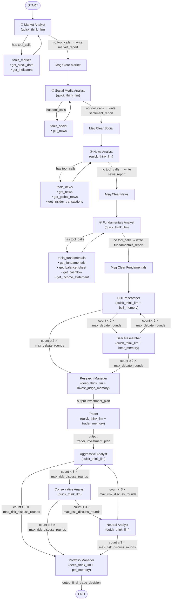
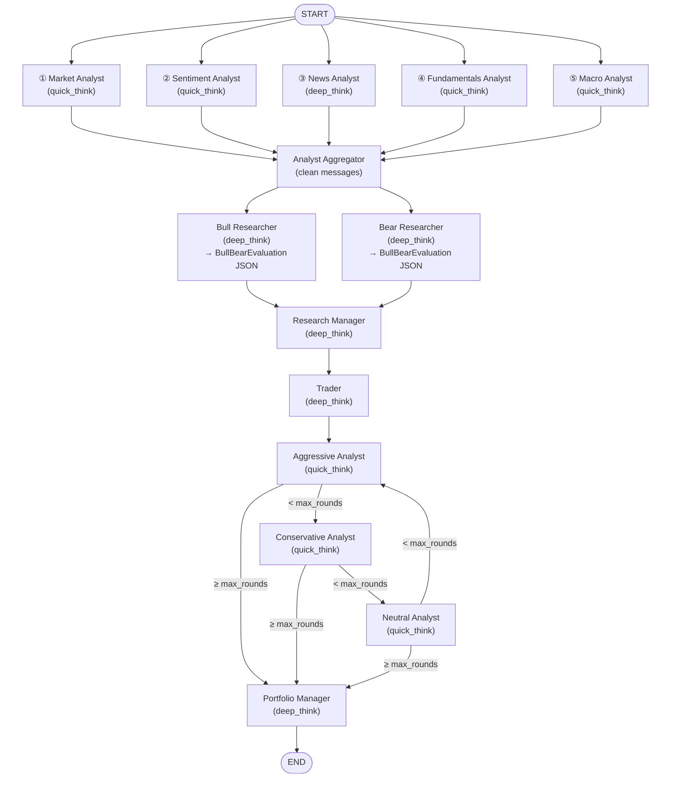

# TradeHive Multi-Agent Trading System — Design Document

**🌐 Language**: [简体中文](DEV_SPEC.md) | **English**

> **Project name**: TradeHive (a multi-agent project derived from TauricResearch/TradingAgents)
> **Positioning**: Multi-agent LLM framework for financial trading decisions
> **Companion doc**: For the original project's design, see [DEV_SPEC_original.md](DEV_SPEC_original.md)

> ⚠️ **Note**: In all configurations, the built-in memory feature is **disabled**.

---

## Table of Contents

- [1. Original Project Baseline](#1-original-project-baseline)
  - [1.1 Data Source & Usability Overhaul](#11-data-source--usability-overhaul)
  - [1.2 Original Project Flowchart](#12-original-project-flowchart)
  - [1.3 Original Project Node Responsibilities](#13-original-project-node-responsibilities)
  - [1.4 Baseline Limitations](#14-baseline-limitations)
- [2. TradeHive System Overview](#2-tradehive-system-overview)
  - [2.1 New Flowchart](#21-new-flowchart)
  - [2.2 Overall Redesign Direction](#22-overall-redesign-direction)
- [3. Analyst Node Redesign](#3-analyst-node-redesign)
  - [3.1 Market Analyst](#31-market-analyst)
  - [3.2 Sentiment Analyst (formerly Social Media)](#32-sentiment-analyst-formerly-social-media)
  - [3.3 Macro Analyst (new)](#33-macro-analyst-new)
  - [3.4 Fundamentals Analyst](#34-fundamentals-analyst)
  - [3.5 News Analyst](#35-news-analyst)
- [4. Downstream Node Redesign](#4-downstream-node-redesign)
  - [4.1 Structured Output Guarantee](#41-structured-output-guarantee)
  - [4.2 Bull / Bear Researcher](#42-bull--bear-researcher)
  - [4.3 Research Manager](#43-research-manager)
  - [4.4 Trader](#44-trader)
  - [4.5 Risk Debaters (Aggressive / Conservative / Neutral)](#45-risk-debaters-aggressive--conservative--neutral)
  - [4.6 Portfolio Manager](#46-portfolio-manager)
- [5. Backtest Engine Design](#5-backtest-engine-design)
  - [5.1 Daily Injected Fields](#51-daily-injected-fields)
  - [5.2 Daily Flow (4 steps)](#52-daily-flow-4-steps)
  - [5.3 Backtest Tuning Philosophy](#53-backtest-tuning-philosophy)
  - [5.4 Unified Bull/Bear Structured Output Downstream](#54-unified-bullbear-structured-output-downstream)
  - [5.5 Prompt Design Principles](#55-prompt-design-principles)
  - [5.6 Confirmed Regime Hard Thresholds](#56-confirmed-regime-hard-thresholds)
  - [5.7 System Philosophy: Low-Frequency, Trend-Oriented](#57-system-philosophy-low-frequency-trend-oriented)
  - [5.8 State Machine Legal Transitions](#58-state-machine-legal-transitions)
  - [5.9 Regime → Position Band Hard Mapping](#59-regime--position-band-hard-mapping)
  - [5.10 Confirmed State: Hard to Enter, Hard to Leave](#510-confirmed-state-hard-to-enter-hard-to-leave)
  - [5.11 Regime Residual Connection Mechanism](#511-regime-residual-connection-mechanism)
- [6. Backtest Comparison & Evaluation](#6-backtest-comparison--evaluation)
  - [6.1 vs. B&H, ETF, Traditional Strategies](#61-vs-bh-etf-traditional-strategies)
  - [6.2 Regime Identification Effectiveness](#62-regime-identification-effectiveness)
  - [6.3 vs. Baseline and Single-Agent](#63-vs-baseline-and-single-agent)
  - [6.4 Multi-Agent Debate vs. Single-Agent Workflow](#64-multi-agent-debate-vs-single-agent-workflow)
- [7. Roadmap](#7-roadmap)
  - [7.1 Crypto Support](#71-crypto-support)
  - [7.2 Portfolio Support](#72-portfolio-support)
  - [7.3 Alternative Improvements](#73-alternative-improvements)

---

## 1. Original Project Baseline

### 1.1 Data Source & Usability Overhaul

The original project's data did not support backtesting — many tools returned live snapshots. We replaced the data sources while keeping the original functionality intact.

It now supports multi-year data; we use 5 years and added local data caching.

For the baseline itself, we kept it as close to the original as possible and only modified what was necessary to make it runnable.

### 1.2 Original Project Flowchart



### 1.3 Original Project Node Responsibilities

| Stage | Node | Model | Inputs | Actual Function |
|-------|------|-------|--------|------------------|
| Investment debate | Bull / Bear Researcher | quick | Four reports (technical, sentiment, news, fundamentals) + memory + debate history. First round reads reports; subsequent rounds rely on debate history and memory | Debate whether the target is worth investing in |
| Investment judgement | Research Manager | deep | Full debate history + four reports (for memory retrieval) + memory | Summarize the debate, make Buy/Sell/Hold decision, draft investment plan |
| Trade translation | Trader | quick | Research Manager's investment plan + four reports + memory | Convert investment plan into an explicit trading signal (BUY/HOLD/SELL) |
| Risk debate | Aggressive / Conservative / Neutral | quick | Trader's trade plan + debate history. First round reads four reports; later rounds use only debate history | Evaluate the risk reasonableness of the Trader's decision; debate whether to be more aggressive or conservative |
| Final decision | Portfolio Manager | deep | Complete risk debate history + Research Manager's investment plan + four reports (for memory retrieval) + memory | Synthesize the risk debate and issue a 5-level rating |

### 1.4 Baseline Limitations

As you can see, this project can only produce a rating; position management and everything else relies on the LLM filling in the gaps.

Decision quality at the daily frequency is extremely poor — the original can only make a decision every ~5 days. Our redesigned multi-agent system supports daily-frequency decisions.

---

## 2. TradeHive System Overview

Built on top of the baseline, but the system has effectively been rebuilt end-to-end.

### 2.1 New Flowchart



### 2.2 Overall Redesign Direction

The original system suffered from missing functionality and unclear, illogical division of labor.

Every node's system prompt has been changed from "you are a helpful AI assistant" to its actual role.

Functional boundaries are tightened — each node is explicitly forbidden from mentioning any trading-decision information.

---

## 3. Analyst Node Redesign

Every prompt has been refined to provide an explicit workflow and instructions for using tool outputs.

### 3.1 Market Analyst

Added: more indicators, share-structure data, percentage moves, weekly-level data.

The minimum data-pull window is fixed at 6 months.

### 3.2 Sentiment Analyst (formerly Social Media)

Evolved from the original Social Media Analyst, which only took news input and was misleadingly named.

Aggregates Alpha Vantage's news sentiment scores by day and produces an LLM-graded score over the chosen window.

Adds VIX data.

### 3.3 Macro Analyst (new)

**Analysis**: Evaluates macro environment from a stock/company-specific angle (not generic macro commentary), across 6 dimensions:

1. **Monetary policy**: Fed Funds Rate + 10Y Treasury → valuation multiples, cost of debt, capital allocation
2. **Inflation**: CPI → Fed policy path, corporate cost structure, pricing power
3. **Growth**: Real GDP → revenue outlook, end demand
4. **Employment**: Unemployment → consumer purchasing power affecting the ticker's customer base
5. **Risk appetite**: VIX → market fear/greed's effect on the ticker's trading environment
6. **FX**: DXY → translation of overseas revenue, import costs

**Output constraints**: Each indicator must map back to the ticker; an overall verdict (Tailwind / Neutral / Headwind) plus 2–3 sentences of reasoning; a summary table is required.

### 3.4 Fundamentals Analyst

Requires explicit analytical dimensions:

- **(a) Profitability**: margins, ROE, earnings growth trajectory
- **(b) Financial health**: debt-to-equity, current ratio, cash reserves
- **(c) Growth**: revenue/earnings growth rates, multi-year YoY trend
- **(d) Valuation**: P/E / P/B / P/S, judged cheap or rich relative to historical range and growth
- **(e) Cash flow quality**: FCF generation, capex intensity, dividend/buyback sustainability

Specific metrics required: P/E, P/B, P/S, ROE, margins, EPS.

### 3.5 News Analyst

Reports must simultaneously cover company developments / sector trends / macro context / insider activity.

---

## 4. Downstream Node Redesign

### 4.1 Structured Output Guarantee

**Two-layer safeguard**:

**Layer 1: `with_structured_output()` — constraint + validation combined**

- Pass in a Pydantic schema; the underlying layer constrains model output via tool calling / JSON mode and validates field types, value ranges, and business semantics

**Layer 2: Fallback retry**

- All three structured nodes (Research Manager, Trader, Portfolio Manager) require this
- **Validation failure**: Feed the ValidationError back to the model to regenerate
- **Call failure** (network timeout, rate limit, 5xx): exponential-backoff retry

### 4.2 Bull / Bear Researcher

**Original role**: Debate whether a position is worth opening.

**New role**: Bull and Bear **independently** distill the 5 reports in parallel (independent evaluations, scores do not influence each other), use the deep-thinking model, and emit structured output.

**Bull/Bear inputs:**

- 5 analyst reports: Market (technical + share structure), Sentiment, News, Fundamentals, Macro
- `prev_regime`: current regime state
- **Complete 7-regime state-machine map** (each regime's legal next-step transitions injected as part of the prompt)
- Past memory: lessons from similar historical situations

**Bull/Bear workflow (prompt-guided):**

1. Read all 5 reports and bucket every piece of information into 4 dimensions (fundamentals, technicals, macro, sentiment)
   - Each piece goes into the most relevant single dimension
2. Filter evidence within the current regime context:
   - Bull looks for evidence supporting upward state-machine paths (upgrade or maintain bullish state)
   - Bear looks for evidence supporting downward state-machine paths (downgrade or maintain bearish state)
3. For each dimension, list up to 5 key pieces of evidence, sorted by importance
4. **Reversal-signal check**: After all evidence is laid out, explicitly check whether any of the **4** legal reversal-signal types appear (default 0 in trending regimes; strong evidence required to override; actual cap is 4 — at most one per type):
   - **Volume/price divergence** — price makes new highs while volume contracts (top), or price makes new lows while volume dries up and selling exhausts (bottom)
   - **Extreme sentiment** — news sentiment score shows uniformly bullish/bearish extreme (contrarian signal)
   - **Price desensitization** — explicit bearish catalyst fails to push price down (bottom signal) or bullish catalyst fails to push price up (top signal)
   - **Decisive reversal day** — single-day ≥8% counter-move + volume ≥1.5× 20-day average + at least one confirming signal (reclaiming short/mid moving average / RSI returning to neutral from oversold or overbought / sector-wide reversal). Specifically captures V-shaped reversals that the first three signal types cannot cover
   - Bull checks for topping signals, Bear for bottoming signals — each side "self-doubts"
   - **Strict constraint**: The prompt explicitly forbids listing RSI, MACD, insider selling, valuation, share structure, or options positioning as standalone reversal signals — those belong in dimension evidence and score, not in `reversal_signals`
   - **Multi-day persistence**: Reversal signals generally require at least 2 consecutive trading days of evidence (filtering single-day noise), with "decisive reversal day" as the explicit exception
5. **Only after all evidence and reversal signals are laid out** does scoring per dimension (1–10) begin. Because of field-ordering constraints, reversal signals are already in the KV cache and naturally factor into the scoring
6. **Compute total first, then deduct line by line** when computing `overall_conviction` (**forced formula**, not a free judgment):
   - **Step 1**: `base = round(avg(4 dimension scores))` — the average of the 4 dimensions (rounded), i.e., the "total"
   - **Step 2**: For each identified reversal signal, explicitly **deduct from base**, with each item stated separately (typically -1 per signal)
   - **Step 3**: The full computation must be written into the `conviction_reasoning` field (example: `Avg(7+9+6+8)/4=7.5→8. -1 extreme sentiment, -1 volume divergence → 6`)
   - The final `overall_conviction` number must match the computation in `conviction_reasoning`
   - Order matters: **compute the 4-dim average first to get the total, then subtract reversals on top** (rather than letting reversals dilute the dimension scores directly)
7. Finally, emit `time_horizon` and `core_thesis`

**Bull/Bear output (structured output, reusing the existing `invoke_structured` + retry mechanism):**

Fields are ordered as follows (order is critical: structured output is generated in field order, and earlier-field content entering the KV cache shapes later-field generation quality):

| Order | Field | Bull meaning | Bear meaning |
|-------|-------|--------------|--------------|
| 1 | fundamentals_evidence | Bullish fundamentals evidence (max 5, ordered by importance) | Bearish fundamentals evidence |
| 2 | technicals_evidence | Bullish technical evidence (max 5) | Bearish technical evidence |
| 3 | macro_evidence | Bullish macro evidence (max 5) | Bearish macro evidence |
| 4 | sentiment_evidence | Bullish sentiment evidence (max 5) | Bearish sentiment evidence |
| 5 | **reversal_signals** | **Topping signals (list[str], 0–4)** | **Bottoming signals (list[str], 0–4)** |
| 6 | fundamentals_score (1–10) | Fundamentals bullishness | Fundamentals bearishness |
| 7 | technicals_score (1–10) | Technical bullishness | Technical bearishness |
| 8 | macro_score (1–10) | Macro bullishness | Macro bearishness |
| 9 | sentiment_score (1–10) | Sentiment bullishness | Sentiment bearishness |
| 10 | **conviction_reasoning** | **Full computation text (generated before the number; forces the LLM to write out average + deduction details)** | **Same** |
| 11 | overall_conviction (1–10) | Overall bullish/bearish conviction (must match the computation in `conviction_reasoning`) | Overall bullish/bearish conviction (must match the computation in `conviction_reasoning`) |
| 12 | time_horizon | "Bullish for X weeks/months" | "Risk persists for X weeks/months" |
| 13 | core_thesis | The single most important argument | The single most important argument |

**Design notes:**

- **Field order = reasoning order**: evidence → reversal_signals → dimension scores → conviction_reasoning → overall_conviction. When the model generates scores, the KV cache already contains reversal signals, so they are naturally factored in; when generating `conviction_reasoning`, all dimension scores and reversal signals are already present; when generating the `overall_conviction` number, the full computation text is in the KV cache so the number must match the text. If `reversal_signals` came after `conviction`, reversal signals could not influence scoring, rendering them useless
- The higher the score, the more bullish (for Bull) / the more bearish (for Bear)
- `prev_regime` is fed in so Bull/Bear can score within the current regime context (a normal pullback in an uptrend shouldn't crater the technical score; a single-day bounce in a downtrend shouldn't tank the bear score — distinguishing "dead cat bounce" from a real reversal)
- **Forced computation transparency**: overall_conviction = round(avg(4-dim)) − Σ(reversal deductions); total first, deduct second. The computation must be written into `conviction_reasoning` for auditing and debugging. The field-order constraint (reasoning before number) ensures the number is derived from reasoning rather than intuition
- **Reversal-signal post-processing**: `filter_reversal_signals()` automatically strips entries containing negation phrases (regex match on `not found` / `not present` / `no signal` / `not detected` / `not applicable` / `does not apply` / `not met`, case-insensitive). This prevents the LLM from polluting `reversal_signals` count with placeholder pseudo-signals (e.g., "price desensitization: NOT FOUND"). Filtered entries log a warning for audit

### 4.3 Research Manager

**Original role**: Summarize the debate, decide Buy/Sell/Hold, draft an investment plan.

**New role**: **Scope radically narrowed — judges only the current regime, makes no trading recommendation** (prompt opens with: `Your ONLY task is to determine the current market regime. You do NOT decide Buy/Sell/Hold — that is the Trader's job.`)

**RM inputs (6 items):**

- Bull structured evaluation (JSON: 4-dim evidence + 4-dim scores + reversal_signals + conviction + core_thesis + time_horizon)
- Bear structured evaluation (same)
- **prev_regime**: yesterday's regime, the starting point for state continuity
- **entry_thesis** (residual connection): the core argument written by RM on the day the current regime first took effect. As long as the regime is unchanged, it is passed back to RM verbatim each day
- **daily_deltas** (residual connection): the cumulative list of "what changed today vs. yesterday" written by RM each day. When the regime switches, the old regime's summary is compressed and stored as a `[Transition from ...]` marker
- **Past memory**: uses `bull.core_thesis + bear.core_thesis` as the memory key to retrieve 2 historical reflections from similar situations (more precise and meaningful than the original's use of the 5 raw reports as the key)

**RM workflow (prompt-enforced):**

1. **Default to retention**: `Your default output is: {prev_regime} (no change)` — only specific, verifiable evidence allows a regime switch
2. **Bull/Bear dimension-by-dimension comparison**: Bull fundamentals 8 vs. Bear fundamentals 3 → strong fundamentals support; close scores → high confidence on that dimension; large divergence → break the tie using evidence quality and reversal signals
3. **Reversal-signal interpretation**:
   - Bull reports 2+ topping signals → even with good scores, may still downgrade
   - Bear reports 2+ bottoming signals → even with bad scores, may still upgrade
   - Core principle: "**When the side that SHOULD be strongest admits weakness, that is high-conviction evidence**"
4. **Legal-transition constraint**: `LEGAL_TRANSITIONS[prev_regime]` is injected as part of the prompt; RM may only choose the next-day regime from this set
5. **Confirmed-state hard thresholds** (listed explicitly in the prompt; RM must self-verify):
   - Enter `confirmed_uptrend`: Bull conviction ≥ 8, Bull tech ≥ 8, Bull fund ≥ 7, Bull reversal_signals = 0, Bear conviction ≤ 6, Bear tech ≤ 6 — **5 of 6**
   - Enter `confirmed_downtrend`: symmetric Bear-side thresholds — **5 of 6**
   - Exit `confirmed_uptrend`: Bull conviction ≤ 7, Bull reversal_signals ≥ 2, Bull tech ≤ 7, Bear conviction ≥ 8, Bear tech ≥ 8 — **4 of 5**
   - Exit `confirmed_downtrend`: symmetric 4 of 5
   - Explicitly: "Normal pullbacks, single bad news events, or short-term technical weakness are NOT sufficient to exit confirmed states"
6. **Thesis-continuity principle**: Before switching regimes, RM must explicitly assess whether the original `entry_thesis` still holds. A thesis is considered invalidated when "a key assumption the thesis relies on is contradicted by new evidence" (e.g., a support level referenced in the thesis is broken, an expected catalyst fails to materialize, dimension scores backing the thesis flip). Only such explicit invalidation triggers a regime switch — preventing "emotional" jumps

**RM output (structured output, 3 fields):**

| Field | Description |
|-------|-------------|
| `market_regime` | One of seven: confirmed_uptrend / early_uptrend / consolidation / topping / early_downtrend / confirmed_downtrend / bottoming |
| `entry_thesis` | The core argument for this regime. If regime is unchanged → repeat yesterday's `entry_thesis` verbatim; if regime changed → write a new thesis. **Will be fed back to RM as "Entry thesis" the next day** |
| `daily_delta` | One sentence: "what is new today vs. yesterday" (new evidence appeared / thesis confirmed / thesis weakened). **Appended to `daily_deltas`, fed back verbatim the next day** |

**Code-layer fallback (`_validate_regime_transition`, does not rely on LLM compliance):**

Research Manager is constrained at the prompt layer; the code layer adds **hard-coded rule fallbacks** to correct LLM violations even when the prompt is ignored:

1. **Illegal transition detection**: If the LLM output isn't in `LEGAL_TRANSITIONS[prev]` → fall back to "the legal regime closest in intent direction" based on `_REGIME_RANK` (0 = confirmed_downtrend ... 6 = confirmed_uptrend)
2. **Confirmed-entry threshold validation**: If the LLM picks `confirmed_*` but the 5-of-6 rule isn't met → force-rollback to `prev_regime`
3. **Auto-upgrade**: If the LLM didn't pick confirmed but the hard threshold is met and legal → code force-upgrades to confirmed (preventing the LLM from being too conservative)
4. **Confirmed-exit threshold validation**: If the LLM wants to leave confirmed but the 4-of-5 rule isn't met → force the regime to stay in confirmed
5. **Auto-downgrade**: If the LLM remains in confirmed but the exit threshold is met → force-exit to `topping` (from confirmed_uptrend) / `bottoming` (from confirmed_downtrend)
6. **Override audit**: Any correction triggers `logger.info` and appends `[Code override: X → Y]` to `entry_thesis` for post-hoc investigation of "why RM and the actual regime disagree"

**Design notes:**

- **Single-responsibility**: RM judges only the regime; action decisions are handed off to Trader and PM downstream. Prevents one node from owning both judgment and action, which would blow up the decision space
- **No raw reports**: RM only sees Bull/Bear's structured JSON, not the 5 raw analyst reports — Bull/Bear have already distilled the reports, so re-reading would waste the context window and introduce inconsistency
- **Residual connection**: The self-loop of `entry_thesis` + `daily_deltas` lets RM see "my own thinking from yesterday" each day, enforcing multi-day judgment consistency and avoiding "today uptrend, tomorrow downtrend" oscillation
- **Two-layer constraint**: prompt layer (LLM self-compliance) + code layer (hard fallback). When the LLM is too conservative, code force-upgrades; when too aggressive, code force-rolls-back. The final regime always satisfies the state machine and hard thresholds
- **regime → position mapping handled by Trader**: RM only outputs the regime label; the actual position band per regime (e.g., confirmed_uptrend → 75–100%) is carried in the Trader node's prompt

> Residual-connection / state-machine details are covered in [§5.8 State Machine Legal Transitions](#58-state-machine-legal-transitions) and [§5.11 Regime Residual Connection Mechanism](#511-regime-residual-connection-mechanism).

### 4.4 Trader

**Original role**: Read 4 raw reports + RM's free-form `investment_plan`, output free-form text ending with `FINAL TRANSACTION PROPOSAL: **BUY/HOLD/SELL**`. **Only a 3-choice discrete action, no notion of position size, no regime constraint, no holding context.**

**New role**: **Execution Planner** — translates the regime identified by Research Manager into a concrete quantitative trade plan. The prompt opens with: `You are the Execution Planner (Trader). The Research Manager has identified the market regime. Your job is to decide the trading direction AND translate it into a concrete, quantitative trading plan.`

**Trader inputs (5 items):**

- **Research Manager decision**: `market_regime` + `entry_thesis` (the core argument for the regime)
- **Bull/Bear structured-eval summary** (`_format_bull_bear_summary`): 4-dim score comparison, top 2 evidence per dimension, overall_conviction, core_thesis, time_horizon, full reversal_signals list
- **Current holding state**: `current_position_pct` (current position %), `avg_cost`, `total_capital`, `unrealized_pnl_pct`, `last_action`
- **Current price**: `current_price`

**Trader decision flow (prompt-guided):**

1. **Decide direction (action)**:
   - Bull conviction significantly > Bear → lean Buy
   - Bear conviction significantly > Bull → lean Sell
   - Balanced or regime is consolidation → lean Hold

2. **Decide target position (`target_position_pct`)**:
   - **Regime determines the band** (hard mapping, see table below)
   - Within the band, **fine-tune** using Bull/Bear conviction: higher Bull → take the upper bound; more reversal signals → take the lower bound

3. **The action label must align with `target_position_pct`** (relativized definition, not absolute direction):
   - **Buy** = `target_position_pct` > current position
   - **Sell** = `target_position_pct` < current position
   - **Hold** = `target_position_pct` within ±3% of current
   - Example: current position 80%, target 60% → even if the regime is uptrend, the action is **Sell** (because we're scaling out)

**Regime → position band hard mapping** (stated in the prompt and enforced at the code layer):

| Regime | Position Band | Intent |
|--------|---------------|--------|
| confirmed_uptrend | **75–100%** | Strong trend, full commitment |
| early_uptrend | 30–60% | Trend forming, probing |
| consolidation | 0–15% | Range-bound, mostly observing |
| topping | 20–40% | Top zone, scaling out |
| early_downtrend | 0–10% | Deterioration, retreating |
| **confirmed_downtrend** | **0% hard-locked** | Fully flat |
| bottoming | 5–20% | Bottom probing entry |

**Execution-time semantics**: The prompt explicitly informs the LLM: `Trades are executed at next trading day's market open at market price`. Today's decision is executed at next day's open. The LLM must understand "today's price is not the execution price" and ignore small intraday moves.

**Trader output (structured output, 3 fields):**

| Field | Type | Description |
|-------|------|-------------|
| `action` | Literal["Buy", "Sell", "Hold"] | One of three, must match `target_position_pct` direction relative to current position |
| `target_position_pct` | float 0–100 | Target total position % after execution |
| `reasoning` | str | Decision rationale; must "ground your reasoning in specific evidence from the Bull/Bear evaluations above" |

**Code-layer fallback (`REGIME_POSITION_LIMITS` clamp, not relying on LLM compliance):**

After the LLM output, the code force-executes a **position clamp**:

1. `raw_pct = decision.target_position_pct` (LLM raw output)
2. `clamped_pct = max(pos_min, min(pos_max, raw_pct))` (clamped to the current regime's band)
3. **If the clamp fires (LLM out of band)**:
   - **Recompute the action label**: based on `clamped_pct` vs. `current_position_pct`, redecide Buy/Sell/Hold so action and target stay consistent
   - **Append `[Clamped from X% to Y% by regime limit]` to the end of `reasoning`** for audit
   - Log `logger.warning`
4. Typical case: in `confirmed_downtrend`, LLM wants to enter at 30% → code forcibly clamps to **0%**; the action gets rewritten to match the 0% target

This fallback **guarantees the executed position always falls within the regime-allowed band**, independent of LLM compliance.

**Key innovations (vs. original):**

1. **From "binary decision" to "continuous position management"**: Original was Buy/Sell/Hold with no quantity; new version emits a continuous `target_position_pct` in 0–100%, supporting partial sizing, scaling in, scaling out, and probe entries
2. **Action is relativized**: Action no longer expresses "absolute directional view"; it expresses "the action relative to the current position" (80% → 60% is Sell even in an uptrend), much closer to real trading semantics
3. **Regime → position hard mapping**: Each regime maps to a position band, both stated in the prompt and enforced in code. Ensures position discipline (`confirmed_downtrend` always flat, `confirmed_uptrend` always heavy)
4. **Holding-state awareness**: Reads current position, cost, P&L, last action — the LLM decides based on "what state am I in" rather than judging direction from scratch every day
5. **Next-day open execution semantics**: The prompt explicitly tells the LLM the decision will execute the next day, preventing the LLM from being misled by minor intraday moves
6. **Code-layer clamp fallback**: Even when the LLM violates the regime band, code force-truncates and rewrites the action label. Prompt layer (LLM self-compliance) + code layer (hard fallback) — double safety

### 4.5 Risk Debaters (Aggressive / Conservative / Neutral)

**Original role**: Adversarial discussion of an abstract "investment proposal", emitting free-form text — no concrete quantitative parameter as the focal point.

**New role**: **Three-way risk-side debate on the Trader's concrete quantitative trade plan** — not abstract "should we buy or sell", but a specific argument about whether the Trader's `target_position_pct` is too aggressive / too conservative / just right. The three debaters speak in parallel over multiple rounds; PM makes the final call.

**Shared inputs across all 3 debaters:**

- **Trader's quantitative plan**: `action` + `target_position_pct` (the **target** of the debate)
- **Research Manager's regime call**: `market_regime` (hard constraint on the position band)
- **Bull/Bear structured-eval summary**: 4-dim score comparison + conviction + reversal_signals (injected only in round count=0; later rounds omit it to save context)
- **Current holding state**: `current_position_pct` + `avg_cost` + `unrealized_pnl_pct` + `current_price`
- **Risk debate history**: `history` + each side's accumulated history + opponents' last responses
- **count**: which round of debate we're in

**Shared evaluation dimensions** (every debater must answer all):

1. Is the Trader's position aligned with the current regime?
2. Is the switch from current `position_pct` to `target_position_pct` reasonable in size?
3. If holding a large position, is the uptrend still intact — are we ignoring reversal signals?

**Stance assignments:**

#### Aggressive Debater

- **Stance**: Take more risk to MAXIMIZE returns
- **Attack direction**: Trader's position is **too small** (e.g., Trader says 30%, this side argues 50%+)
- **Argument angle**: In favorable conditions Trader is too timid and misses profit
- **Opponents**: Responds to Conservative and Neutral

#### Conservative Debater

- **Stance**: Capital preservation is the top priority
- **Attack direction**: Trader's position is **too large** (e.g., Trader says 40%, this side argues 20% or less)
- **Argument angle**: In uncertain conditions, excessive optimism ignores specific risks
- **Opponents**: Responds to Aggressive and Neutral

#### Neutral Debater

- **Stance**: Balanced — weighing "opportunity cost of over-conservatism" vs. "risk of over-aggressiveness"
- **Attack direction**: **Criticizes both** Aggressive (unnecessary gambling) and Conservative (giving up profit unnecessarily)
- **Argument angle**: Concretely evaluates whether Trader's position matches conviction + market conditions
- **Opponents**: Challenges blind spots on both sides

**Debate mechanics:**

- **Sequential per round**: Each round goes Aggressive → Conservative → Neutral; each can see the prior speaker's points and rebut
- **count incremented**: Each debater statement increments `count`
- **Bull/Bear summary in round 0 only**: When `count == 0`, the full 4-dim score comparison and reversal_signals are injected; later rounds omit them (since the conversation history already contains them)
- **Cumulative speeches**: `aggressive_history` / `conservative_history` / `neutral_history` accumulate each side's full speeches for PM review
- **Stable target**: Throughout the debate, Trader's `target_position_pct` is the **single shared target**; the three sides argue around this number without abstract digressions

**Output**: Each round, each debater appends a free-form text to `risk_debate_state.history` and writes into its own accumulated history. After all rounds, PM reads the full `history` for the final ruling.

**Design notes:**

- **The debate target is a concrete number (`target_position_pct`) rather than an abstract proposal**: The three sides no longer debate "buy or sell" (binary) but rather "30% or 50%" (quantitative) — debate can directly translate into parameter adjustment
- **Sharp stances + mutual rebuttal**: Each debater is required in the prompt to "respond directly to the counter-arguments" — no monologues. PM sees full adversarial coverage of a single number
- **Holding context fully exposed**: Cost, P&L, current position are all visible to the debaters — so "scale out to lock in profit" vs. "hold to chase more profit" can be argued with real data, not abstract risk talk
- **Regime as shared constraint**: All three see `market_regime`; even Aggressive cannot break "confirmed_downtrend should be flat" — they can only tug within the regime-allowed band
- **Cooperation with Trader-layer code clamp**: Debater-proposed adjustments are passed to PM; PM's final output goes through the same `REGIME_POSITION_LIMITS` clamp

### 4.6 Portfolio Manager

**Position**: **Portfolio Manager is the final arbiter of the entire pipeline**, emitting the day's single executable trade instruction `final_trade_decision`. The prompt opens with: `As the Portfolio Manager, you make the final trading decision. Synthesize the risk analysts' debate and the Trader's proposed plan into a definitive, executable instruction.`

**PM inputs (7 items):**

- **Research Manager decision**: `market_regime` + `entry_thesis`
- **Bull/Bear structured-eval summary**: 4-dim score comparison, `overall_conviction`, `core_thesis`, full `reversal_signals`
- **Trader's quantitative plan**: `action` + `target_position_pct` + `reasoning` (starting point for PM, who may modify it)
- **Full risk-debate history**: full accumulated speeches of Aggressive / Conservative / Neutral (`risk_debate_state.history`)
- **Current holding state**: `current_position_pct` / `avg_cost` / `total_capital` / `unrealized_pnl_pct` / `last_action`
- **Yesterday's own reasoning** (`prev_reasoning`): PM's own rationale from yesterday, for decision continuity
- **Past memory**: uses Bull/Bear `core_thesis` as memory key to retrieve 2 historical reflections

**PM decision flow (prompt-enforced):**

1. **Explicit relativized action definition** (consistent with Trader):
   - Buy = `target_pct` > current (scaling in)
   - Sell = `target_pct` < current (scaling out)
   - Hold = `target_pct` within ±3% of current
   - action label must match the direction of `target_pct` vs. current

2. **Hard regime-band clamp** (emphasized **twice** in the prompt; also code-enforced):
   - Prompt lists all 7 regime position bands
   - Adds: "**Your `target_position_pct` MUST be between {pos_min}% and {pos_max}%. Any value outside this range is invalid and will be clamped by the system.**"
   - The current regime's `pos_min` / `pos_max` are dynamically injected into the prompt so the LLM sees the hard boundary directly

3. **Risk-gatekeeping rules**:
   - "Profitable AND survivable": position must survive a single-day large adverse move without panic exit
   - "Non-negotiable regime limits": you cannot use your own conviction or fundamentals to break the regime hard boundary
   - "Don't be afraid of large positions in confirmed uptrend"
   - "Capital preservation in unclear/deteriorating conditions"

4. **Must respond to the risk debate** (**CRITICAL** requirement):
   - In `reasoning`, PM must **explicitly engage with each risk analyst's key points**
   - For each major argument, take an explicit stance ("accepted" or "rejected") with rationale
   - **Forbidden**: writing only "I have considered the debate" — must engage with specific arguments
   - Purpose: make the debate actually influence the decision; prevent PM from rubber-stamping Trader's plan and turning the debate into a sham

5. **Accept or modify Trader's plan**:
   - PM may **fully accept** Trader's `target_position_pct`
   - Or **adjust** (e.g., Aggressive persuades → scale up; Conservative persuades → scale down)
   - PM's `target_pct` is the **final effective value**; Trader's plan is only the starting point

**PM output (structured output, 3 fields):**

| Field | Type | Description |
|-------|------|-------------|
| `action` | Literal["Buy", "Sell", "Hold"] | Must match `target_position_pct` direction vs. current |
| `target_position_pct` | float 0–100 | **Final target position to be executed at next day's open by the backtest engine** |
| `reasoning` | str | Decision rationale; must explicitly engage with the risk debate |

PM's output is written into two state fields:

- `final_trade_decision`: the backtest engine reads this as the next-day open execution instruction
- `risk_debate_state.judge_decision`: recorded as the final ruling on the debate

**Code-layer fallback (symmetric `REGIME_POSITION_LIMITS` clamp like Trader):**

1. `raw_pct = decision.target_position_pct` (LLM raw output)
2. `clamped_pct = max(pos_min, min(pos_max, raw_pct))` (clamped to current regime's band)
3. If clamp fires:
   - **Recompute the action label** so it's consistent with `clamped_pct`
   - Append `[Clamped from X% to Y% by regime limit]` to `reasoning`
   - Log `logger.warning`
4. This is the **last line of defense** — even when Trader's clamp passed but the debate then persuaded PM out of band, PM clamp catches it

**PM vs. Trader (both Execution roles — why two layers?)**

| Dimension | Trader | PM |
|-----------|--------|-----|
| Position | **Before** debate | **After** debate |
| Role | Propose **initial** quantitative plan based on Bull/Bear | Make **final** ruling after the risk debate |
| Inputs | Doesn't see debate history | **Must see full debate history** |
| Context | Doesn't see yesterday's own reasoning | **Sees yesterday's own reasoning** (`prev_reasoning`) |
| Hard-constraint strength | Prompt says "Position sizing by market regime" | Prompt **additionally** emphasizes "HARD LIMITS — you MUST NOT exceed" + dynamically injected `{pos_min}%-{pos_max}%` + "clamped by the system" warning |
| Reasoning requirement | "ground in Bull/Bear evidence" | Must **respond line by line to each risk analyst** |
| Use of output | The **target** of the debate | **Directly executed** by the backtest engine |

**Design notes:**

1. **PM is the pipeline's terminal output**: Only PM's `final_trade_decision` is read by the backtest engine and executed at next day's open; Trader's plan is just an input to the debate
2. **Must respond to the debate** (the most critical innovation): the prompt explicitly says "do NOT simply say 'I have considered'" — prevents PM from going through the motions on the debate and forces the three-way debate to actually shape the decision
3. **Double clamp redundancy**: Trader has already clamped once; PM clamps again. Seemingly redundant, but it's necessary when "PM is persuaded by Aggressive to raise the position" — Trader's clamp couldn't know how much the debate would shift PM
4. **Decision continuity (`prev_reasoning` residual connection)**: PM sees its own reasoning from yesterday, maintaining multi-day decision consistency. Similar to RM's `entry_thesis` mechanism but at the action layer rather than the regime layer
5. **Regime boundary emphasized multiple times in the prompt**: PM's prompt mentions the regime band three times (basic definition + dynamic injection of "between X% and Y%" + "HARD LIMITS you MUST NOT exceed") — more strict than Trader's one mention. This is because PM is the most likely to be persuaded out of band (Aggressive's rhetoric is seductive) and needs repeated reminders

---

## 5. Backtest Engine Design

### 5.1 Daily Injected Fields

**Daily injected fields fall into two groups**: a **position snapshot** (provided by `PositionTracker.get_state_dict()`) and **cross-day continuity data** (residual-connection state maintained by the engine). Both groups are bundled and injected before each day's pipeline starts.

**Group 1: Position snapshot** ([position.py:52-60](tradingagents/backtesting/position.py#L52-L60), `get_state_dict()`)

| Field | Meaning | Usage |
|-------|---------|-------|
| `current_position_pct` | Current position as % of total capital (0–100%) | Agents decide whether to scale in / scale out |
| `avg_cost` | Average cost basis | Agents evaluate current P&L |
| `total_capital` | Total account value (cash + holdings market value) | Trader/PM base for position % calculation |
| `last_action` | Previous action (Buy/Sell/Hold) | Agents understand recent trade direction |
| `unrealized_pnl_pct` | Unrealized P&L percentage | Computed from `avg_cost` and current price |

**Group 2: Cross-day continuity data** ([engine.py:120-130](tradingagents/backtesting/engine.py#L120-L130), appended by the engine)

| Field | Meaning | Read By |
|-------|---------|---------|
| `current_price` | Today's close | Trader / PM for current-price reference |
| `prev_reasoning` | Yesterday's PM reasoning (truncated to 500 chars) | PM for decision continuity |
| `prev_regime` | Yesterday's regime state | RM / Bull / Bear as state-machine starting point |
| `regime_entry_reasoning` | The `entry_thesis` written by RM on the day the current regime first took effect | RM residual connection — preserves judgment consistency within a regime |
| `regime_daily_deltas` | Cumulative `daily_delta` written by RM each day within the current regime | RM residual connection — sees its own incremental thinking from prior days |

These 9 fields together form the complete context injected into the pipeline each backtest day.

### 5.2 Daily Flow (4 steps)

1. **Open execution**: Execute yesterday's `pending_decision.target_position_pct` at today's **open price**. PositionTracker computes the buy/sell share delta and updates `shares` / `cash` / `avg_cost` / `total_fees`
2. **Close snapshot**: At today's **close**, call `position.get_state_dict(close_price)` to generate the position snapshot, append cross-day continuity data (`current_price`, `prev_reasoning`, `prev_regime`, `regime_entry_reasoning`, `regime_daily_deltas`), bundle into `pos_state`, and inject into the agent state
3. **Run the full pipeline**: Execute in order analysts → Bull/Bear → RM → Trader → Risk debaters → PM. The pipeline emits `final_trade_decision` (PM's JSON) and `investment_plan` (RM's JSON)
4. **Extract residuals and update engine state**:
   - `final_trade_decision` → next day's `pending_decision` (instruction to execute at next open)
   - `final_trade_decision.reasoning` → next day's `prev_reasoning`
   - `investment_plan.market_regime` → next day's `prev_regime` (if regime unchanged, keep `regime_entry_reasoning` and append today's `daily_delta` to `regime_daily_deltas`; if regime changed, compress the old regime's `entry_thesis` into a `[Transition from ...]` summary as the starting `daily_deltas` for the new regime, and overwrite `regime_entry_reasoning` with the new regime's `entry_thesis`)

**T-day decision → T+1 open execution**: Every backtest day's PM decision doesn't take effect that same day; it executes at next day's open. This matches the real-trading semantics of "decide after close, order at next open" and means the price agents see (close) is not the execution price (next open). Trader/PM prompts explicitly tell the LLM about this to prevent being misled by minor intraday moves.

### 5.3 Backtest Tuning Philosophy

Backtesting is not about giving the LLM total freedom; human trading intuition inevitably shapes the system.

The overall approach: first set a large-scale trading thesis, then run and see whether it can be realized — if not, switch; if yes, tune parameters/prompts so results better fit the desired profile.

By observing backtest results and trade-by-trade activity, you can identify specific tuning targets (e.g., we found Bear Researcher is over-sensitive to weak technical signals and prints inflated scores — so we give it more grounding).

### 5.4 Unified Bull/Bear Structured Output Downstream

Downstream nodes uniformly consume Bull/Bear's structured output instead of the raw reports.

After Bull/Bear's distillation, the 5 raw analyst reports are not forwarded further. Downstream receives:

- **RM**: Bull/Bear structured output → regime decision
- **Trader**: regime + Bull/Bear structured output → position plan
- **Risk debaters**: Trader plan + Bull/Bear structured output → risk review
- **PM**: all of the above + debate conclusions → final decision

Bull/Bear outputs each have a bias, but downstream nodes seeing two opposing structured views is more valuable than seeing a single synthesized report (preserves detail and adversarial framing). RM's synthesized judgment is already embodied in the regime — no additional condensed report is needed.

### 5.5 Prompt Design Principles

Across all nodes — beyond simply giving the model explicit instructions — our prompts are designed to maximize reasoning quality:

- Use CoT to specify reasoning order; adjust JSON-schema field order so that the KV cache contains what's needed first, giving subsequent reasoning and conclusions stronger grounding
- Force the model to respond point-by-point to report content / cite specific arguments — prevents skipping key information
- State precise field definitions inside the prompt
- Distill the key principles of trading explicitly
- Use few-shot examples to help the model understand
- Where appropriate, use code-level hard logic instead of the LLM, preventing hallucinations and imprecise instruction-following from producing low-quality outputs (state machine, position limits, regime confirmation/exit transitions, etc.)

### 5.6 Confirmed Regime Hard Thresholds

**Uptrend entry — 6 conditions** (≥ 5 must be met to upgrade to `confirmed_uptrend`):

- Bull conviction ≥ 8
- Bull technicals ≥ 8
- Bull fundamentals ≥ 7
- Bull reversal_signals = 0
- Bear conviction ≤ 6
- Bear technicals ≤ 6

**Downtrend entry — 6 conditions** (mirror):

- Bear conviction ≥ 8
- Bear technicals ≥ 8
- Bear fundamentals ≥ 7
- Bear reversal_signals = 0
- Bull conviction ≤ 6
- Bull technicals ≤ 6

**Uptrend exit — 5 conditions** (≥ 4 triggers downgrade to `topping`):

- Bull conviction ≤ 7
- Bull reversal_signals ≥ 2
- Bull technicals ≤ 7
- Bear conviction ≥ 8
- Bear technicals ≥ 8

**Downtrend exit — 5 conditions** (≥ 4 triggers downgrade to `bottoming`, fully mirrored):

- Bear conviction ≤ 7
- Bear reversal_signals ≥ 2
- Bear technicals ≤ 7
- Bull conviction ≥ 8
- Bull technicals ≥ 8

If the LLM tries to make an illegal modification on its own, it is force-corrected, and a brief explanatory note is appended to state — to inform downstream that the system overrode the LLM, avoiding confused reasoning later.

### 5.7 System Philosophy: Low-Frequency, Trend-Oriented

We do low-frequency decisions, so the bulk of profit comes from trends.

Ideally one could also do small swing trading to amplify profit.

But empirically, just by correctly identifying ranging/downtrend states, sizing positions properly (no short selling, no small swings — anything outside the uptrend phase is essentially non-productive trading), and putting enough capital to work in uptrends, you already get an excellent result.

We built the state machine to prevent rapid large position changes and frequent extreme opinion swings.

### 5.8 State Machine Legal Transitions

```
confirmed_uptrend   → topping
early_uptrend       → confirmed_uptrend / consolidation
consolidation       → early_uptrend / early_downtrend
topping             → consolidation / early_downtrend / early_uptrend
early_downtrend     → confirmed_downtrend / consolidation
confirmed_downtrend → bottoming
bottoming           → consolidation / early_uptrend / early_downtrend
```

(The state machine and residual connections both serve specific needs and also lower system sensitivity.)

### 5.9 Regime → Position Band Hard Mapping

Regime-defined holding ranges prevent the LLM from being too conservative when it should be bold, and from being too heavy when it should be cautious:

| Regime | Position range |
|--------|----------------|
| confirmed_uptrend | 75–100% |
| early_uptrend | 30–60% |
| consolidation | 0–15% |
| topping | 20–40% |
| early_downtrend | 0–10% |
| confirmed_downtrend | 0% |
| bottoming | 5–20% |

As shown, we're only willing to size up at bottoms / early uptrend / confirmed uptrend / near tops — reflecting the author's own trading philosophy.

### 5.10 Confirmed State: Hard to Enter, Hard to Leave

> **The trend is your friend.** Once a market starts trending in one direction, it is more likely to continue than to reverse.

We designed the mechanism so that `confirmed_uptrend` / `confirmed_downtrend` are **hard to enter, hard to leave**.

The primary causes and conditions of a sustained uptrend often persist throughout the trend (and similar persistence holds in other regimes), so the relevant information and conclusions need to propagate forward across the time series over longer horizons — hence the residual-connection mechanism described next.

### 5.11 Regime Residual Connection Mechanism

**Problem**: Originally only `prev_regime` (a label) was carried forward day to day, and RM judged the regime from scratch each day. If day 3 decided `confirmed_uptrend`, on day 4 RM has no idea why we entered that regime in the first place, no awareness of what happened in between — easily misjudging due to single-day noise.

**Design**: Borrowing from ResNet residual connections — don't just pass the regime label, also pass the residual of the reasoning, so RM makes incremental judgments on top of historical reasoning rather than rebuilding from scratch each day.

**3 new State fields** (`agent_states.py`):

| Field | Meaning |
|-------|---------|
| `prev_regime` | Previous day's regime label (existing) |
| `regime_entry_reasoning` | Full reasoning written when entering the current regime (entry thesis) |
| `regime_daily_deltas` | Accumulated daily-change summaries, tagged with regime and date |

**RM output new fields** (`schemas.py`):

| Field | Meaning |
|-------|---------|
| `entry_thesis` | Core argument for the current regime. Written once when first entering the regime; every subsequent day the regime is unchanged, RM **repeats this verbatim** (keeping the entry thesis stable) |
| `daily_delta` | One sentence: what changed today vs. yesterday (new evidence emerged / thesis confirmed / thesis weakened) |

**Accumulation rules** (`engine.py`, cross-day execution):

1. **Regime unchanged**:
   - `regime_entry_reasoning` stays put (locked on first entry)
   - `regime_daily_deltas` is appended with `[Day YYYY-MM-DD | regime] daily_delta`
   - Current implementation has **no length cap** — accumulates unconditionally. A long regime (e.g., 60+ days of `confirmed_uptrend`) may yield several thousand characters of `daily_deltas`, all passed into the RM prompt

2. **Regime switched**:
   - Old `regime_entry_reasoning` is **truncated to the first 300 characters** (`entry_reasoning[:300] + "..."`, a simple string slice — **not LLM compression**)
   - The truncated text is written into the new `regime_daily_deltas` as a transition marker: `[Transition from old_regime] truncated_text`
   - The new `entry_thesis` becomes the new `regime_entry_reasoning`
   - Begin a fresh accumulation

**RM prompt injection** (`research_manager.py`):

```
## Entry Thesis (when current regime was entered)
{regime_entry_reasoning or "(First day — no prior thesis)"}

## Daily Updates
{regime_daily_deltas or "(No prior updates)"}

**Thesis continuity**: Before concluding, explicitly assess whether the entry thesis still holds.
```

RM is asked to first assess whether the entry thesis still holds, then decide whether to switch the regime. This creates an inertia: "default to retention unless the thesis is invalidated".

**Data flow**:

```
engine.py ──inject──▶ state ──read──▶ research_manager.py
    ▲                                      │
    │              market_regime            │
    │              entry_thesis             │
    └──accumulate── daily_delta ◀──output───┘
```

**Reader/writer summary**:

- **Writer**: `engine.py` (sole) — accumulates and injects daily
- **Reader**: `research_manager.py` (sole) — used for regime decision
- Bull/Bear only read `prev_regime` (the label), not the residual fields
- Trader / PM do not touch the residual fields; PM reads the current-day `market_regime` from RM's output

---

## 6. Backtest Comparison & Evaluation

### 6.1 vs. B&H, ETF, Traditional Strategies

The headline cumulative return may not look dramatically higher, but actually outperforming an ultra-strong trend stock like NVDA is a strong result.

And we did it under the constraint that the max drawdown is held to a very tight bound — drawdown control is excellent.

Had we started earlier (before 2025-02-20), position would have been effectively controlled throughout.

This also implies that loosening our position rules would lift returns considerably.

### 6.2 Regime Identification Effectiveness

We achieved precise identification of the current regime and precise identification of inflection points entering and exiting confirmed states.

(Regime identification overlaid on the daily chart goes here.)

**Why didn't we exit to topping at the end?**

Because by design, exiting confirmed states is hard.

NVDA didn't really sell off afterwards — it even printed new highs. August looked like a top, but it's very similar to the mid-May to mid-June period; ruling out continuation of the main uptrend is genuinely difficult.

Let's look at the daily scores to see whether exiting is actually difficult:

```
date        regime                bu_cbu_tbu_fbu_r be_cbe_tbe_fbe_r | UenUexDenDex
----------------------------------------------------------------------------------
2025-02-20  consolidation            6   7   9   2    6   6   7   0 |   3  3  3  2 *
2025-02-21  early_downtrend          7   7  10   0    5   6   7   1 |   4  2  1  2 *
2025-02-24  confirmed_downtrend      5   5   9   2    7   9   8   0 |   1  4  5  1 *
2025-02-25  confirmed_downtrend      7   5   7   0    7   8   7   0 |   2  3  4  1
2025-02-26  confirmed_downtrend      4   6   9   3    5   5   6   1 |   3  3  2  2
2025-02-27  confirmed_downtrend      6   6   9   1    7   8   7   0 |   1  3  5  1
2025-02-28  confirmed_downtrend      7   5   9   0    7   8   7   1 |   2  3  3  1
2025-03-03  confirmed_downtrend      7   7   9   0    7   8   6   2 |   2  3  1  2
2025-03-04  confirmed_downtrend      5   4   9   1    8   9   8   0 |   1  4  6  0
2025-03-05  confirmed_downtrend      7   5   9   0    6   7   7   2 |   3  2  2  3
2025-03-06  confirmed_downtrend      6   4   9   1    7   9   7   0 |   1  3  5  1
2025-03-07  confirmed_downtrend      7   5   9   0    7   8   6   2 |   2  3  2  2
2025-03-10  confirmed_downtrend      6   5   9   1    7   8   6   0 |   1  3  4  1
2025-03-11  confirmed_downtrend      7   5   9   0    1   1   1   2 |   4  2  1  3
2025-03-12  confirmed_downtrend      6   5   9   1    7   8   6   0 |   1  3  4  1
2025-03-13  confirmed_downtrend      7   5   9   0    6   8   7   0 |   3  3  4  1
2025-03-14  confirmed_downtrend      7   5   9   0    6   7   8   1 |   3  2  2  2
2025-03-17  confirmed_downtrend      7   5   9   1    7   8   7   0 |   1  3  4  1
2025-03-18  confirmed_downtrend      8   5  10   0    8   8   7   0 |   3  3  5  1
2025-03-19  confirmed_downtrend      7   5   9   1    7   8   7   0 |   1  3  4  1
2025-03-20  confirmed_downtrend      6   6   7   0    6   7   7   1 |   3  2  3  2
2025-03-21  confirmed_downtrend      8   6   9   0    7   8   7   1 |   3  2  3  2
2025-03-24  confirmed_downtrend      7   7   9   1    7   7   7   4 |   1  2  1  3
2025-03-25  confirmed_downtrend      8   7  10   0    5   6   7   1 |   5  1  1  3
2025-03-26  confirmed_downtrend      7   5   9   0    8   9   8   0 |   2  4  5  0
2025-03-27  confirmed_downtrend      7   6   9   0    7   8   7   0 |   2  3  4  1
2025-03-28  confirmed_downtrend      6   4  10   1    7   8   6   0 |   1  3  4  1
2025-03-31  confirmed_downtrend      7   5   9   0    5   8   8   1 |   3  3  3  1
2025-04-01  confirmed_downtrend      8   6   9   0    7   8   7   2 |   3  2  3  3
2025-04-02  confirmed_downtrend      8   6  10   0    6   8   8   2 |   4  2  3  3
2025-04-03  confirmed_downtrend      5   4   9   1    7   8   7   1 |   1  3  4  1
2025-04-04  confirmed_downtrend      8   5  10   0    8   9   8   0 |   3  3  5  1
2025-04-07  confirmed_downtrend      6   4  10   2    7   8   6   1 |   1  4  3  1
2025-04-08  confirmed_downtrend      7   5   9   0    8   9   8   0 |   2  4  5  0
2025-04-09  confirmed_downtrend      5   6   9   2    5   5   7   1 |   3  3  3  2
2025-04-10  confirmed_downtrend      6   4   9   1    7   8   7   0 |   1  3  5  1
2025-04-11  confirmed_downtrend      6   5   9   1    6   6   7   1 |   3  2  3  2
2025-04-14  confirmed_downtrend      7   5   9   0    6   7   6   1 |   3  2  1  2
2025-04-15  confirmed_downtrend      5   4   9   0    4   6   2   0 |   4  2  3  2
2025-04-16  confirmed_downtrend      7   4   9   0    7   8   7   0 |   2  3  4  1
2025-04-17  confirmed_downtrend      7   5   9   0    7   8   7   0 |   2  3  4  1
2025-04-21  confirmed_downtrend      5   4   9   2    7   8   7   0 |   1  4  5  1
2025-04-22  confirmed_downtrend      7   5   9   0    8   8   8   0 |   2  4  5  0
2025-04-23  confirmed_downtrend      8   6   9   0    4   6   6   1 |   5  1  1  3
2025-04-24  confirmed_downtrend      7   6   9   1    7   7   7   1 |   1  2  2  2
2025-04-25  bottoming                8   7   9   0    7   7   8   2 |   3  1  1  4 *
2025-04-28  bottoming                8   7   9   0    5   7   6   0 |   4  1  1  3
2025-04-29  bottoming                7   7  10   0    7   9   7   0 |   2  3  3  1
2025-04-30  bottoming                8   7   9   0    7   8   7   0 |   3  2  3  2
2025-05-01  bottoming                7   6   9   0    7   7   6   0 |   2  2  2  2
2025-05-02  bottoming                7   5   9   0    7   8   7   0 |   2  3  4  1
2025-05-05  early_uptrend            8   8   9   0    6   6   7   2 |   6  0  1  5 *
2025-05-06  confirmed_uptrend        8   8  10   0    5   5   5   0 |   6  0  1  4 *
2025-05-07  confirmed_uptrend        8   8  10   1    4   4   5   0 |   5  0  1  4
2025-05-08  confirmed_uptrend        7   7   8   0    5   7   7   0 |   3  2  2  2
2025-05-09  confirmed_uptrend        8   8   9   0    5   5   4   1 |   6  0  0  4
2025-05-12  confirmed_uptrend        8   8   9   0    6   5   6   0 |   6  0  1  4
2025-05-13  confirmed_uptrend        8   8   9   0    5   4   7   0 |   6  0  2  4
2025-05-14  confirmed_uptrend        8   9   9   0    7   7   4   0 |   4  0  1  4
2025-05-15  confirmed_uptrend        9   8   9   0    6   7   6   0 |   5  0  1  4
2025-05-16  confirmed_uptrend        8   8   9   0    6   5   6   0 |   6  0  1  4
2025-05-19  confirmed_uptrend        8   8   9   0    6   6   6   0 |   6  0  1  4
2025-05-20  confirmed_uptrend        8   8   9   0    7   6   7   0 |   5  0  2  4
2025-05-21  confirmed_uptrend        8   7   9   0    6   5   6   0 |   5  1  1  3
2025-05-22  confirmed_uptrend        8   8   9   0    6   6   6   0 |   6  0  1  4
2025-05-23  confirmed_uptrend        8   8   9   0    5   6   5   0 |   6  0  1  4
2025-05-27  confirmed_uptrend        9   8  10   0    6   6   6   0 |   6  0  1  4
2025-05-28  confirmed_uptrend        8   8   9   0    6   5   7   0 |   6  0  2  4
2025-05-29  confirmed_uptrend        8   8   9   0    7   7   7   0 |   4  0  2  4
2025-05-30  confirmed_uptrend        5   7   9   3    6   7   7   0 |   2  3  3  2
2025-06-02  confirmed_uptrend        8   7   9   0    7   7   7   0 |   3  1  2  3
2025-06-03  confirmed_uptrend        8   8   9   0    6   6   6   0 |   6  0  1  4
2025-06-04  confirmed_uptrend        8   8   9   0    7   7   7   0 |   4  0  2  4
2025-06-05  confirmed_uptrend        7   7  10   1    3   7   3   0 |   2  2  1  2
2025-06-06  confirmed_uptrend        9   9  10   0    7   6   7   0 |   5  0  2  4
2025-06-09  confirmed_uptrend        6   7   9   2    7   7   8   0 |   1  3  3  2
2025-06-10  confirmed_uptrend        6   7   9   2    5   7   6   0 |   2  3  2  2
2025-06-11  confirmed_uptrend        8   7   9   0    6   6   7   0 |   5  1  2  3
2025-06-12  confirmed_uptrend        8   8   9   0    4   4   5   0 |   6  0  1  4
2025-06-13  confirmed_uptrend        6   6   9   2    7   7   8   0 |   1  3  4  2
2025-06-16  confirmed_uptrend        8   8   9   0    6   6   7   0 |   6  0  2  4
2025-06-17  confirmed_uptrend        8   7   9   0    5   7   6   0 |   4  1  1  3
2025-06-18  confirmed_uptrend        9   8  10   0    6   6   6   0 |   6  0  1  4
2025-06-20  confirmed_uptrend        7   7   9   1    6   5   8   0 |   3  2  2  2
2025-06-23  confirmed_uptrend        8   8   9   0    6   6   7   0 |   6  0  2  4
2025-06-24  confirmed_uptrend        8   6   9   0    6   6   6   0 |   5  1  2  3
2025-06-25  confirmed_uptrend        9   8  10   0    5   8   5   0 |   5  1  2  3
2025-06-26  confirmed_uptrend        5   8   9   3    7   7   8   0 |   2  2  3  3
2025-06-27  confirmed_uptrend        6   5   8   1    4   5   5   0 |   3  2  3  2
2025-06-30  confirmed_uptrend        7   8   9   0    7   7   6   0 |   3  1  1  3
2025-07-01  confirmed_uptrend        6   8   9   2    6   6   7   0 |   4  2  3  3
2025-07-02  confirmed_uptrend        9   8   9   0    7   7   8   0 |   4  0  2  4
2025-07-03  confirmed_uptrend        8   8   8   0    7   7   7   0 |   4  0  2  4
2025-07-07  confirmed_uptrend        8   7   9   0    3   5   3   0 |   5  1  1  3
2025-07-08  confirmed_uptrend        6   8  10   2    6   6   7   0 |   4  2  3  3
2025-07-09  confirmed_uptrend        7   8   9   1    7   6   7   0 |   3  1  2  3
2025-07-10  confirmed_uptrend        8   7   9   0    5   6   7   0 |   5  1  2  3
2025-07-11  confirmed_uptrend        8   8   9   0    6   4   8   0 |   6  0  2  4
2025-07-14  confirmed_uptrend        8   8   9   0    5   4   7   0 |   6  0  2  4
2025-07-15  confirmed_uptrend        9   8   9   0    5   7   7   0 |   5  0  2  4
2025-07-16  confirmed_uptrend        8   8   9   1    3   4   3   0 |   5  0  1  4
2025-07-17  confirmed_uptrend        7   8  10   2    7   7   7   0 |   2  2  2  3
2025-07-18  confirmed_uptrend        7   8   9   1    7   6   8   0 |   3  1  2  3
2025-07-21  confirmed_uptrend        8   8   9   0    6   6   6   0 |   6  0  1  4
2025-07-22  confirmed_uptrend        8   7   9   0    6   6   7   0 |   5  1  2  3
2025-07-23  confirmed_uptrend        9   8   9   0    7   6   7   0 |   5  0  2  4
2025-07-24  confirmed_uptrend        8   8   9   0    6   6   7   0 |   6  0  2  4
2025-07-25  confirmed_uptrend        7   8   9   1    6   6   7   0 |   4  1  2  3
2025-07-28  confirmed_uptrend        7   8   9   1    6   7   6   0 |   3  1  1  3
2025-07-29  confirmed_uptrend        5   7   9   3    7   7   8   0 |   1  3  3  2
2025-07-30  confirmed_uptrend        7   8  10   1    6   7   6   0 |   3  1  1  3
2025-07-31  confirmed_uptrend        8   8   9   0    6   6   7   0 |   6  0  2  4
2025-08-01  confirmed_uptrend        7   7   9   1    6   7   7   0 |   2  2  2  2
2025-08-04  confirmed_uptrend        8   8  10   0    6   5   6   0 |   6  0  1  4
2025-08-05  confirmed_uptrend        8   7  10   0    6   9   6   1 |   4  2  1  2
2025-08-06  confirmed_uptrend        9   8  10   0    7   7   7   0 |   4  0  2  4
2025-08-07  confirmed_uptrend        8   7   9   0    7   6   7   0 |   4  1  2  3
2025-08-08  confirmed_uptrend        8   7   9   0    7   7   7   0 |   3  1  2  3
2025-08-11  confirmed_uptrend        8   7  10   0    6   6   7   0 |   5  1  2  3
2025-08-12  confirmed_uptrend        9   8  10   0    6   5   7   0 |   6  0  2  4
2025-08-13  confirmed_uptrend        8   8   9   0    6   6   7   0 |   6  0  2  4
2025-08-14  confirmed_uptrend        7   7  10   1    6   7   6   0 |   2  2  1  2
2025-08-15  confirmed_uptrend        9   8  10   0    6   5   6   0 |   6  0  1  4
2025-08-18  confirmed_uptrend        8   7   9   0    6   6   6   0 |   5  1  1  3
2025-08-19  confirmed_uptrend        8   7  10   0    6   7   5   0 |   4  1  1  3
2025-08-20  confirmed_uptrend        8   8   9   0    5   7   3   0 |   5  0  1  4
```

Although exit signals are sparse in the latter half, you can see that during the early phase, the uptrend-exit signal is functioning.

You can also tell from the `confirmed_uptrend` entry point that our system is right-sided. To improve identification further, you could tune parameters/prompts for more sensitivity, but you may then miss profits elsewhere.

**Is the scoring stochastic — would the next run be reproducible?** We've run several full or sectional tests, and entry/exit points are stable, though some randomness is inherent.

**How does it look on a different ticker?** Signal identification and performance on META are also strong.

The biggest issue is that the LLM is expensive and slow. A 6-month window isn't that short, but performance on tickers that aren't long-trending / strong-trending — or that may reverse quickly — is up for discussion. Robust optimization and broader market/feature coverage are beyond what we can fully tackle without spending several times the money and effort.

In principle, this system can be optimized and extended further; the ceiling is not yet reached.

### 6.3 vs. Baseline and Single-Agent

#### Baseline's backtest logic: hard-coded mapping rules

| Rating | Action |
|--------|--------|
| BUY | Full long (100%) |
| OVERWEIGHT | Up to 60% |
| HOLD | No change |
| UNDERWEIGHT | Down to 30% |
| SELL | Fully exit (0%) |

Position state lives only inside the simulator engine; the agent has no knowledge of the current position at decision time.

The trading logic: analyze and produce a report/strategy after today's close, place orders at tomorrow's open to rebalance.

The original design fundamentally doesn't support high-frequency decisions; during NVDA's selloff after 2025-02-14, it directly produced a drawdown of over -30%.

In practice we ran it many times — results were highly random, not reproducibly performant.

### 6.4 Multi-Agent Debate vs. Single-Agent Workflow

#### Theoretical advantages of multi-agent debate

- **When information is highly ambiguous/conflicting**: e.g., earnings strong but macro weak — bull/bear each take one side; forced adversarial reasoning exposes single-perspective blind spots
- **Low-frequency major decisions**: monthly rebalances, major events (around earnings) — a single decision worth multi-angle scrutiny
- **Risk-event evaluation**: "should we go heavy at this level" — multi-perspective reasoning can reduce catastrophic mistakes

#### Practical problems of multi-agent debate

- **Debates tend to be wishy-washy**: bull and bear each make their points, Research Manager tends toward Hold, diluting strong signals
- **Cost is high, latency is high**: more LLM calls = more token cost + more latency; at daily frequency you pay this every day
- **Noise injection**: with many rounds, the LLM may fabricate arguments to "rebut the other side", actually lowering signal quality
- **Most trading days don't need a debate**: trend-continuation days are the majority; signals are inherently clear; the marginal value of debate is low

#### Advantages of single-agent + structured workflow

- **Decisive on strong signals**: a single agent reads all data and decides directly, no debate dilution
- **High determinism**: workflows can hard-code risk rules (stop-loss validation, single-trade risk cap), not rely on LLM "discussion"
- **Fast and cheap**: fewer LLM calls, well-suited to daily or higher-frequency decision settings
- **Coherent context**: a single agent is easier to keep consistent across days

#### Conclusion

The decisive factor for system performance is not the number of agents but: (1) data quality and feature selection, (2) whether risk rules are hard-coded rather than relying on LLM debate, (3) prompt design for trend judgment, (4) the math model for position management. Multi-agent debate is better suited as a "safety mechanism" for low-frequency decisions, not as the "daily decision mechanism" for daily-frequency trading.

Even without multi-round debate, you can simulate adversarial analysis and give downstream nodes a view of it — which is exactly what our Bull and Bear Researcher nodes do.

---

## 7. Roadmap

### 7.1 Crypto Support

(To be filled in.)

### 7.2 Portfolio Support

(To be filled in.)

### 7.3 Alternative Improvements

- Under different regimes, the dominant market dimension differs — how to let the LLM recognize this
- Up/down attribution
- Better data sources (Alpha Vantage is primarily a financial-analysis vendor; news timeliness and coverage are not always sufficient)
