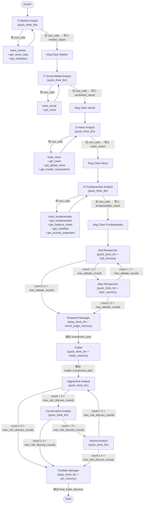
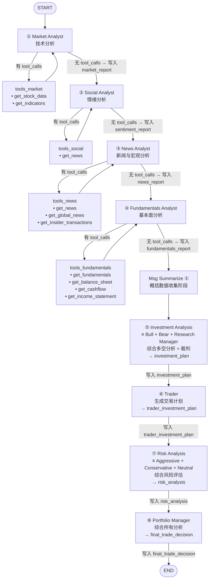

这个文档有没有前后设计不一致的地方。

注意分析师步骤其实偏向：编排式工作流

> **TODO**：
分化维度 ⑤ 动态交互（Agent 间）和 ⑥ 独立状态目前尚无对应的技术设计章节，后续需补充说明两者对实验评估指标的意义，以及在回测中如何观测这两个维度的差异。

设计单agent和多agent系统tools暴露机制，实验性加入更多

# Single-Agent 架构设计文档


## 1. 设计目标

在保持与 multi-agent **相同的工作流结构**（相同阶段、工具分配）的前提下，将多个独立角色替换为**同一个 agent 身份**，作为对比 baseline。投资辩论和风控辩论阶段各以**单次综合分析**替代多轮辩论循环。

**核心原则**：通过控制变量法，在 prompt 分化、memory 分化、上下文分化、LLM 分化、动态交互、独立状态六个维度上做对比实验，精确验证各维度的分化对分析质量的影响。

### 1.1 Multi-Agent vs Single-Agent 的根本区别

Single-Agent 和 Multi-Agent 之间不是非黑即白的对立，而是一个**分化程度的连续光谱**。二者的工作流结构可以完全相同（相同的阶段、工具、辩论轮次），差异体现在以下 6 个分化维度上——每多加一个维度的分化，就更偏向 Multi-Agent；全部统一，就是最纯粹的 Single-Agent：

#### 分化维度 ① Prompt 分化：独立角色 prompt vs 共享 base prompt

**Multi-Agent**：12 个节点各有独立的角色身份和专属 system prompt。Market Analyst 的 prompt 只讲技术分析，Bull Researcher 的 prompt 只讲"emphasize growth potential"。每个角色有**身份驱动的行为一致性**——Bull 不会突然开始讲风险。

**Single-Agent**：所有节点共享同一个 Agent 的 base prompt，通过阶段任务指令切换关注点（"本阶段请关注技术分析"→"本阶段请分析看多方向"）。同一个 Agent 在"分析看多"阶段可能不自觉地保留上一阶段的中立倾向，缺乏角色驱动的**极端化激励**。

**对抗性影响**：Prompt 分化直接决定辩论的对抗性。Multi-Agent 的 Bull 和 Bear 使用**对立的 system prompt**，各自被激励去最大化己方论点，形成真正的信息对抗。Single-Agent 虽然结构上也有看多→看空的多轮辩论，但同一个 Agent 的内在偏好一致，容易出现**一致性偏差**——不会真正用力反驳自己。

#### 分化维度 ② Memory 分化：角色专属记忆 vs 统一记忆

**Multi-Agent**：5 个独立的 Memory 实例（`bull_memory`、`bear_memory`、`trader_memory`、`invest_judge_memory`、`portfolio_manager_memory`）。每个角色从自己的视角反思——Bull 学到"在某种形态下高估了增长"，Bear 学到"在同一形态下低估了风险"。下次辩论时各自检索**角色专属**的历史教训。


**Single-Agent**：1 个统一 Memory。反思内容混合了所有视角，无法区分"Bull 判断失误"还是"Bear 论证不力"。检索时各视角的历史教训互相干扰，难以提供角色针对性的经验。

> **注**：Memory 分化与 Prompt 分化是**独立可控**的两个维度。理论上，Single-Agent 也可以按阶段维护多个 memory 实例（按 phase_key 分别存储和检索），Multi-Agent 也可以让所有角色共享同一个 memory。本设计中选择让 Single-Agent 使用 1 个统一 memory，是作为**控制变量的实验设计**：在去除角色身份分化的前提下，观察统一 memory 对分析质量的影响。这是一个刻意的实验选择，而非因为它在逻辑上依赖 Prompt 分化。


#### 分化维度 ③ 上下文分化：Msg Clear 隔离 vs Msg Summarize 连续上下文

**Multi-Agent**：阶段间使用 `Msg Clear` 完全清空 messages。每个角色只能通过 state 字段读取上一阶段的结构化结果，看不到其他角色的推理过程。角色间的信息隔离是天然的。

**Single-Agent**：在关键阶段转换点使用 `Msg Summarize`——额外做一次 LLM 调用，将之前累积的全部 messages 概括为一段精炼摘要，然后用摘要替换原始 messages。非 summarize 点的 messages 原样保留，agent 可以看到当前阶段内的完整推理过程以及之前阶段的摘要。

> **Msg Summarize 触发点**（共 1 次）：
> 1. **数据收集全部完成后**（4 个 Analyst 结束）——工具调用产生大量 token，后续分析阶段不需要原始数据细节
>
> 投资分析和风控分析各只有 1 次 LLM 调用，不会累积大量 messages，无需额外 summarize。
>
> 此外，当累积 messages 接近 context window 阈值（如 60-70%）时，也可触发一次额外的 summarize 作为安全机制。

**对抗性影响**：Multi-Agent 的 Msg Clear 让 Bear 只能看到 Bull 的结论（通过 state 字段），看不到 Bull 的推理链，必须独立构建反驳。Single-Agent 的连续上下文让 agent 在看空阶段能看到自己之前看多阶段的完整推理，可能导致反驳时"手下留情"——这是一致性偏差的又一来源。

#### 分化维度 ④ LLM 分化：混合模型 vs 统一模型

**Multi-Agent**：大部分节点用 `quick_think_llm`（如 gpt-5-mini），仅 Research Manager 和 Portfolio Manager 两个裁判节点用 `deep_think_llm`（如 gpt-5.2）。成本高效：16-20 次调用但大部分便宜。

**Single-Agent**：全部使用同一个 LLM

#### 分化维度 ⑤ 动态交互（Agent 间）

**Multi-Agent**：多个独立 agent 之间可以产生真正的 **inter-agent 协商**——Bear 能够针对 Bull 的具体论点逐条反驳，而不只是输出一段独立的看空分析；Research Manager 可以根据辩论质量动态决定是否要求补充轮次。这种交互模式是涌现的，不需要提前写死。

> **注**：此处的"动态交互"特指 agent 与 agent 之间的交互，而非 agent 的自主行为能力。Single-Agent 系统同样可以设计成自主式（如 ReAct 风格），能够自主决定是否继续调用工具、是否补充分析；但它无法产生真正的 inter-agent 协商——同一个认知实体无法真正"回应"自己之前的论点，自问自答本质上是结构化生成而非对抗性交互。

**Single-Agent**：辩论是同一个 agent 按预设顺序切换视角，生成看多分析→生成看空分析，无法产生真正的 inter-agent 对抗。即使加入更强的对抗性指令，也只是引导同一实体模拟反驳，而非两个具有对立目标函数的实体真实碰撞。

#### 分化维度 ⑥ 独立状态

**Multi-Agent**：每个 agent 有自己的记忆、目标、工具集。这与 Memory 分化和 Prompt 分化相关但更根本——它意味着每个 agent 是一个**自洽的认知实体**，而非同一实体的不同"模式"。Bull 的目标函数和 Bear 的目标函数是根本对立的。

**Single-Agent**：只有一个认知实体，通过任务指令临时切换关注点。所有"角色"共享同一个目标函数和认知倾向，缺乏真正的目标对立。

---

**分化光谱总览**：

```
极简 Single ←————————————————————————————→ 完整 Multi

              │  极简 Single  │ 本设计 Single │  完整 Multi    │
──────────────┼───────────────┼───────────────┼────────────────┤
① Prompt      │  共享 base    │  共享 base    │  独立角色 prompt│
② Memory      │     无        │  1 个统一     │  5 个专属       │
③ 上下文      │     无        │  Summarize    │  Clear 隔离     │
④ LLM         │   统一        │   统一        │ quick+deep 混用 │
⑤ 动态交互    │     无        │     无        │ inter-agent 协商│
⑥ 独立状态    │     无        │     无        │  对立目标函数   │
```

**本设计的定位**：保持与 Multi-Agent 相同的工作流结构，在 Prompt 分化、Memory 分化、上下文分化（Msg Clear vs Msg Summarize）、LLM 分化、动态交互（Agent 间）、独立状态（对立目标函数）六个维度上做区分，验证单 agent 和多 agent 系统的表现区别。

---

## 2. 流程对比图

### Multi-Agent 流程



**Multi-Agent LLM 调用次数**（默认配置 max_debate_rounds=1, max_risk_discuss_rounds=1）：
- 4 个 Analyst（每个可能多次 tool loop） ≈ 8-12 次
- Bull + Bear 辩论 = 2 次
- Research Manager = 1 次
- Trader = 1 次
- Aggressive + Conservative + Neutral 辩论 = 3 次
- Portfolio Manager = 1 次
- **总计约 16-20 次 LLM 调用**

---

### Single-Agent 流程

**设计原则**：去除辩论结构，以单次综合分析替代多轮辩论循环。数据收集阶段与 Multi-Agent 完全相同；**投资辩论阶段**（Bull + Bear + Research Manager）合并为一个 `investment_analysis` 综合分析步骤；**风控辩论阶段**（Aggressive + Conservative + Neutral + Portfolio Manager）中前三角色合并为一个 `risk_analysis` 综合分析步骤，Portfolio Manager 单独保留。



**Single-Agent LLM 调用次数**：
- 4 个数据收集阶段（每个可能多次 tool loop） ≈ 8-12 次
- 综合投资分析（`investment_analysis`） = 1 次
- 交易计划（`trader`） = 1 次
- 综合风控分析（`risk_analysis`） = 1 次
- 最终决策（`portfolio_manager`） = 1 次
- Msg Summarize = 1 次（数据收集完成后）
- **总计约 13-17 次 LLM 调用**

---

### 关键差异对比

两张流程图的**工具分配、State 字段相同**，差异体现在六个分化维度上（辩论结构已从 Single-Agent 中移除）：

| 维度 | Multi-Agent | Single-Agent | 是否构成差异 |
|------|------------|--------------|-------------|
| Prompt | 12 个独立角色身份 prompt（身份驱动行为） | 1 个 base prompt + 8 套任务指令（任务驱动行为） | **是** |
| 辩论结构 | Bull + Bear 多轮对抗辩论；Aggressive + Conservative + Neutral 多轮风控辩论 | 投资辩论替换为 1 次综合多空分析；风控辩论替换为 1 次综合风险评估，无多轮循环 | **是**（结构性差异） |
| Memory | 5 个角色专属 memory，各自从自身视角反思 | 1 个统一 memory，各视角反思混合存储 | **是** |
| 上下文管理 | Msg Clear 完全清空，角色间信息隔离 | Msg Summarize 概括后保留，agent 可见完整分析链 | **是** |
| LLM 选型 | quick_think 为主 + 2 个 deep_think 裁判 | 全部使用同一个 LLM | **是** |
| 动态交互 | agent 间可真实协商，Bear 针对 Bull 具体论点逐条反驳 | 同一 agent 一次性综合多空，无 inter-agent 对抗 | **是** |
| 独立状态 | 各角色具有对立目标函数，是独立的认知实体 | 只有一个认知实体，所有视角共享同一目标函数 | **是** |
| LLM 调用次数 | 16-20 次 | 13-17 次（含 1 次 summarize） | 略有差异 |
| 工具分配 | 相同 | 相同 | 否 |
| State 字段 | 相同 | 相同 | 否 |
| 条件路由 | 无辩论循环路由 | 无辩论循环路由 | 否 |

**实验的六个对比维度**：Prompt 分化（身份驱动 vs 任务驱动）、辩论结构（多轮对抗 vs 单次综合分析）、Memory 分化（角色专属 vs 统一）、上下文分化（Msg Clear 隔离 vs Msg Summarize 连续）、LLM 分化（混合模型 vs 统一模型）、动态交互（真实 inter-agent 协商 vs 单一认知实体综合分析）。通过对比可验证这六个维度的分化对分析质量的影响。

## 3. 技术设计

> Multi-Agent 项目的完整架构详见 `DEV_SPEC.md`。本节仅说明在现有代码基础上**如何改造**以支持 Single-Agent 模式。

### 3.1 改造策略

在现有 Multi-Agent 代码基础上，通过 `mode` 参数切换两种模式。**直接复用**的模块（无需任何修改）：

- `AgentState` / `InvestDebateState` / `RiskDebateState`（State 结构完全相同）
- 4 个 `ToolNode` 及 `_create_tool_nodes()`（工具分配完全相同）
- `conditional_logic.py`（条件路由完全复用）
- `propagation.py`（初始 state 和 `propagate()` 直接复用）
- 所有 `dataflows/`、`llm_clients/`、`agents/utils/` 模块

**需要改动/新增**的部分：

| 改动点 | 说明 |
|--------|------|
| **新建** `single_agent.py` | 共享 base prompt + 12 套阶段指令 + `create_phase_node()` 工厂函数 |
| **修改** `trading_graph.py` | 新增 `mode` 参数，single 模式下创建 1 个统一 memory + 12 个阶段节点 |
| **修改** `setup.py` | 新增 `setup_single_agent_graph()`，图结构与 `setup_graph()` 相同，节点实现不同 |
| **修改** `reflection.py` | 新增 `reflect_single_agent()`，5 视角反思写入 1 个统一 memory |
| **修改** `main.py` | 添加 single-agent 调用示例 |

### 3.2 Agent 节点实现（核心改动）

新建 `tradingagents/agents/single_agent.py`。核心思路：**工厂函数** `create_phase_node()` 接受阶段指令 + 工具 + 输出字段，生成与现有 multi-agent 节点**签名兼容**的节点函数（接收 state，返回 state 更新）。

```python
from langchain_core.prompts import ChatPromptTemplate, MessagesPlaceholder
from tradingagents.agents.utils.agent_utils import build_instrument_context

# ===== 共享 Base Prompt（所有阶段共用，区别于 multi-agent 的独立 system prompt）=====
SINGLE_AGENT_BASE_PROMPT = """You are a trading analyst for {company} as of {date}.

{instrument_context}

## Current Phase Instruction
{phase_instruction}

{memory_context}
"""

# ===== 8 套阶段特定指令 =====
PHASE_INSTRUCTIONS = {
    # --- 第一阶段：数据收集（带工具） ---
    "market_analyst": """Focus on TECHNICAL ANALYSIS. Use the available tools to gather price data and technical indicators.
You MUST call: get_stock_data, get_indicators (select up to 8 complementary indicators).
Produce a comprehensive market/technical analysis report.""",

    "social_analyst": """Focus on SOCIAL MEDIA SENTIMENT. Use the available tools to gather social media and news sentiment.
You MUST call: get_news (for social sentiment data).
Produce a sentiment analysis report.""",

    "news_analyst": """Focus on NEWS AND MACRO ANALYSIS. Use the available tools to gather news and insider activity.
You MUST call: get_news, get_global_news, get_insider_transactions.
Produce a news and macro analysis report.""",

    "fundamentals_analyst": """Focus on FUNDAMENTAL ANALYSIS. Use the available tools to gather financial data.
You MUST call: get_fundamentals, get_balance_sheet, get_cashflow, get_income_statement.
Produce a fundamental analysis report.""",

    # --- 第二阶段：综合投资分析（无工具，替代 Bull + Bear + Research Manager 辩论） ---
    "investment_analysis": """Based on the research reports provided, conduct a comprehensive investment analysis
covering BOTH bullish and bearish perspectives in a single pass.

Bullish analysis: Identify the strongest growth drivers, positive catalysts, and upside scenarios.
Bearish analysis: Identify key risks, negative catalysts, and downside scenarios.
Synthesis: Weigh the strength of each side based on evidence quality. Produce a balanced
investment_plan with a clear directional recommendation (Buy / Hold / Sell), confidence level,
and key supporting rationale.""",

    # --- 第三阶段：交易计划（无工具） ---
    "trader": """Based on the investment_plan provided, produce a concrete, actionable trading plan
including: entry price, exit target, position sizing, stop-loss level, and time horizon.""",

    # --- 第四阶段：综合风控分析（无工具，替代 Aggressive + Conservative + Neutral 辩论） ---
    "risk_analysis": """Based on the trader_investment_plan provided, conduct a comprehensive risk assessment
covering multiple perspectives in a single pass.

Opportunity perspective: Analyze why the risk is acceptable and what upside would be missed by
being overly cautious.
Capital-preservation perspective: Analyze tail risks, worst-case scenarios, and reasons to reduce
position size.
Balanced perspective: Weigh the above arguments objectively. Identify the 2-3 key risk factors
that should drive the final sizing decision. Produce a risk_analysis summary.""",

    # --- 最终决策 ---
    "portfolio_manager": """Review the trading plan and the risk_analysis above.
Produce the final_trade_decision with: Rating, Confidence, Position sizing, Stop-loss, Time horizon.""",
}


def create_phase_node(phase_key, tools, llm, output_field=None, memory=None):
    """
    阶段节点工厂：生成与 multi-agent 节点签名兼容的节点函数。

    Args:
        phase_key: PHASE_INSTRUCTIONS 中的 key
        tools: 该阶段可用的工具列表（分析阶段有工具，辩论/决策阶段为 []）
        llm: LLM 实例
        output_field: 输出写入的 state 字段名（如 "market_report"、"investment_plan"）
        memory: FinancialSituationMemory 实例（仅辩论/决策阶段使用）
    """
    phase_instruction = PHASE_INSTRUCTIONS[phase_key]

    def node(state):
        current_date = state["trade_date"]
        company = state["company_of_interest"]
        instrument_context = build_instrument_context(company)

        # Memory 检索（仅有 memory 的阶段）
        memory_str = ""
        if memory:
            past = memory.get_memories(
                f"Trading analysis for {company} on {current_date}", n_matches=2
            )
            if past:
                memory_str = "Lessons from past similar situations:\n"
                for rec in past:
                    memory_str += rec["recommendation"] + "\n\n"

        prompt = ChatPromptTemplate.from_messages([
            ("system", SINGLE_AGENT_BASE_PROMPT),
            MessagesPlaceholder(variable_name="messages"),
        ])
        prompt = prompt.partial(
            company=company,
            date=current_date,
            instrument_context=instrument_context,
            phase_instruction=phase_instruction,
            memory_context=memory_str,
        )

        if tools:
            chain = prompt | llm.bind_tools(tools)
        else:
            chain = prompt | llm

        result = chain.invoke(state["messages"])

        updates = {"messages": [result]}
        # 当没有 tool_calls 时，将结果写入对应的 state 字段
        # （与 multi-agent 各节点的写入逻辑一致）
        if output_field and not getattr(result, "tool_calls", []):
            updates[output_field] = result.content
        return updates

    return node
```

### 3.3 Graph 组装

在 `setup.py` 中新增 `setup_single_agent_graph()`。将 Msg Clear 节点替换为 1 个 Msg Summarize 节点（数据收集后），去除辩论循环边（Bull↔Bear、Agg→Con→Neu 的 count 路由），改为线性串行：`investment_analysis → trader → risk_analysis → portfolio_manager`。将各角色节点替换为 `create_phase_node()` 生成的实例。

实现建议：将 `setup_graph()` 中的边定义逻辑抽取为内部方法 `_wire_edges()`，供两个 setup 方法共用，避免代码重复。

### 3.4 TradingAgentsGraph 适配

在 `trading_graph.py` 的 `TradingAgentsGraph.__init__()` 中新增 `mode` 参数：

```python
class TradingAgentsGraph:
    def __init__(self, ..., selected_analysts=["market", "social", "news", "fundamentals"], mode="multi"):  # ← 新增 mode
        self.mode = mode
        # ... 现有公共初始化（LLM 客户端、config 等）...

        if mode == "single":
            # Memory：1 个统一实例（替代 multi-agent 的 5 个独立实例）
            self.single_memory = FinancialSituationMemory(
                "single_agent_memory", self.config
            )

            # 工具节点：直接复用
            self.tool_nodes = self._create_tool_nodes()

            # 8 个阶段节点（同一 base prompt，不同 phase instruction，无辩论循环）
            from tradingagents.agents.single_agent import create_phase_node
            llm = self.quick_thinking_llm  # 全部使用同一个 LLM
            mem = self.single_memory
            single_nodes = {
                # 第一阶段：数据收集（带工具 + 输出字段，无 memory）
                "market_analyst":       create_phase_node("market_analyst",
                    [get_stock_data, get_indicators], llm,
                    output_field="market_report"),
                "social_analyst":       create_phase_node("social_analyst",
                    [get_news], llm,
                    output_field="sentiment_report"),
                "news_analyst":         create_phase_node("news_analyst",
                    [get_news, get_global_news, get_insider_transactions], llm,
                    output_field="news_report"),
                "fundamentals_analyst": create_phase_node("fundamentals_analyst",
                    [get_fundamentals, get_balance_sheet, get_cashflow, get_income_statement], llm,
                    output_field="fundamentals_report"),
                # 第二阶段：综合投资分析（单次，替代多轮辩论；有 memory）
                "investment_analysis":  create_phase_node("investment_analysis", [], llm,
                    output_field="investment_plan", memory=mem),
                # 第三阶段：交易计划
                "trader":               create_phase_node("trader", [], llm,
                    output_field="trader_investment_plan", memory=mem),
                # 第四阶段：综合风控分析（单次，替代多轮辩论；无 memory）
                "risk_analysis":        create_phase_node("risk_analysis", [], llm,
                    output_field="risk_analysis"),
                # 最终决策
                "portfolio_manager":    create_phase_node("portfolio_manager", [], llm,
                    output_field="final_trade_decision", memory=mem),
            }

            self.graph = self.graph_setup.setup_single_agent_graph(
                single_nodes, self.tool_nodes, selected_analysts
            )
        else:
            # 现有 multi-agent 初始化逻辑（不改动）
            ...
```

### 3.5 Reflection 适配

在 `reflection.py` 中新增 `reflect_single_agent()` 方法。复用现有 5 个 reflect 方法中相同的**上下文提取和反思 prompt 逻辑**，但将所有反思结果写入同一个 `single_memory`（而非 5 个独立 memory）。

> **注**：`reflect_single_agent()` 沿用现有 reflect 方法的参数传入模式，`single_memory` 作为参数而非 `self` 属性。

```python
# tradingagents/graph/reflection.py — 新增方法（Reflector 类内）

def reflect_single_agent(self, state, single_memory, returns_losses):
    """
    单 agent 模式的反思。
    与 multi-agent 的 5 个 reflect 方法使用相同的反思逻辑，
    但所有结果写入同一个 unified memory（无法按角色隔离检索）。
    """
    # 单 agent 模式无辩论历史，从各综合分析输出字段提取上下文
    reflect_configs = [
        ("investment_analysis", state.get("investment_plan", "")),
        ("trader",              state.get("trader_investment_plan", "")),
        ("risk_analysis",       state.get("risk_analysis", "")),
        ("portfolio_manager",   state.get("final_trade_decision", "")),
    ]

    for perspective, situation in reflect_configs:
        if not situation:
            continue
        prompt = f"""Review this trading decision from the {perspective} perspective.
Decision: {state['final_trade_decision']}
Context: {situation}
Returns/Losses: {returns_losses}

What went well? What should be improved?
Provide a concise lesson learned for future similar situations."""

        response = self.quick_thinking_llm.invoke(prompt)
        single_memory.add_memory(situation, response.content)
```

---

## 4. 文件改动清单

| 文件 | 操作 | 说明 |
|------|------|------|
| `tradingagents/agents/single_agent.py` | **新建** | Base prompt + 8 套阶段指令（无辩论节点）+ `create_phase_node()` 工厂 |
| `tradingagents/graph/trading_graph.py` | 修改 | `mode` 参数 + single 分支初始化 |
| `tradingagents/graph/setup.py` | 修改 | 新增 `setup_single_agent_graph()`，Msg Clear → 1 个 Msg Summarize，去除辩论循环边，线性串行图结构 |
| `tradingagents/graph/reflection.py` | 修改 | 新增 `reflect_single_agent()` |
| `main.py` | 修改 | 添加 `mode="single"` 调用示例 |

其余所有文件（State、工具、条件路由、Propagation、数据层、LLM 客户端等）**均不改动**，详见 `DEV_SPEC.md`。

---

## 5. 调用示例

```python
# main.py
from tradingagents.graph.trading_graph import TradingAgentsGraph
from dotenv import load_dotenv

load_dotenv()

config = {...}  # 配置详见 DEV_SPEC.md

# Single-Agent 模式
ta = TradingAgentsGraph(debug=True, config=config, mode="single")
_, decision = ta.propagate("NVDA", "2024-05-10")
print("Single Agent Decision:", decision)
```

---

## 6. 对比评估要点

| 维度 | Single Agent | Multi Agent |
|------|-------------|-------------|
| LLM 调用次数 | 13-17 次（含 1 次 Msg Summarize） | 16-20 次 |
| Token 消耗 | 略低（去除辩论循环，单次综合分析 prompt 覆盖多视角） | 略高（多轮辩论累积 token） |
| 延迟 | 略低（无辩论循环） | 略高 |
| 分析深度 | 同一 Agent 单次综合多空，无对抗摩擦，深度依赖 prompt 质量 | 独立角色多轮对抗辩论，信息对抗充分，结论经反驳验证 |
| 多视角覆盖 | 单次分析需在一个 prompt 内覆盖所有视角，覆盖面依赖指令 | 独立角色身份天然驱动视角分化，各视角有极端化激励 |
| 上下文连续性 | Msg Summarize 保留分析链摘要，后续阶段可见前序推理 | Msg Clear 完全隔离，角色间只通过 state 字段传递结果 |
| Memory 质量 | 1 个统一 memory，反思混合，无法分角色检索 | 5 个独立 memory，角色专属反思 |
| LLM 选型 | 全部使用同一个 LLM | quick_think 为主 + 2 个 deep_think 裁判 |
| 动态交互 | 同一 agent 单次综合分析，无 inter-agent 对抗 | 独立 agent 间真实协商，Bear 可逐条针对 Bull 论点 |
| 独立状态 | 单一认知实体，所有视角共享同一目标函数 | 各角色具有对立目标函数，辩论存在真实张力 |

建议在回测中记录以下额外指标：
- **分析覆盖度**：综合分析 prompt 中多空论点的实质性差异度（可用 embedding 距离衡量）
- **决策一致性**：同一输入多次运行的决策是否一致
- **Memory 质量**：反思内容的视角区分度（单一 memory 中各阶段反思是否趋同）
- **每次决策的 token 数**

---

## 7. 注意事项

1. **阶段指令质量是关键**：Single-Agent 的表现高度依赖 12 套 phase instruction 的设计质量——它们需要足够清晰地引导同一个 Agent 在不同阶段表现出截然不同的关注点和立场
2. **一致性偏差是核心挑战**：同一个 Agent 先分析看多方向再分析看空方向，天然倾向于在看空阶段"留情面"，不会真正用力反驳自己之前的看多论点。Msg Summarize 保留的上下文摘要会加剧这一倾向。可通过更强的对抗性指令（如"你必须找出对方论点的 3 个致命缺陷"）来缓解
3. **Memory 混合问题**：1 个统一 memory 中，Bull 视角的反思和 Bear 视角的反思混合存储，检索时可能互相干扰。检索 query 的设计需要考虑这一点
4. **LLM 分化是独立的对比维度**：Single-Agent 全部使用同一个 LLM，Multi-Agent 混用 quick_think + deep_think，这本身就是 6 个分化维度之一。后续可通过让 Single-Agent 也混用模型（或让 Multi-Agent 全用同一模型）来单独验证 LLM 分化的影响
5. **保持接口一致**：`propagate()` 的返回格式（`final_state, decision`）在两种模式下保持一致，回测框架无需区分模式
