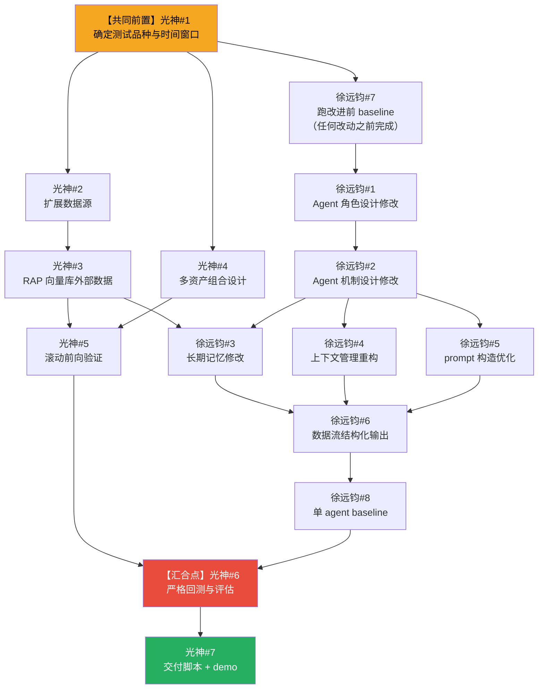

# 任务执行顺序与依赖

## 执行顺序总览

---

## 光神任务

### 1. 确定测试品种与时间窗口
- **前置依赖**: 无，最先执行
- **说明**: 所有回测与数据工作的基础输入，两人都依赖此结论

### 2. 扩展数据源
- **前置依赖**: #1
- **注意**: 实际数据接入可与徐远钧并行推进，但需**优先定好数据接口**（函数签名、返回字段格式），同步给徐远钧，使其 agent 层可面向接口开发，不被数据源实现阻塞

### 3. RAP 向量库外部数据（需支持回测的历史数据）
- **前置依赖**: #2
- **可与 #4 并行**

### 4. 多资产组合设计
- **前置依赖**: #1（品种确定后即可设计）
- **可与 #3 并行**
- **⚠️ 高难度**：实现层涉及 agent 输出格式重构、组合权重聚合逻辑、回测引擎改造，横跨两条线，是全项目改动面最广的任务，建议优先评估工作量再决定实现深度

### 5. 滚动前向验证（Roll-forward Validation）
- **前置依赖**: #3、#4（需要向量库数据与多资产组合设计均就绪）

### 6. 对多 agent 策略结果进行严格的金融回测与评估
- **前置依赖**: 光神 #5（#3、#4 已通过 #5 隐式依赖）+ 徐远钧 #8（multi-agent 跑通）
- **说明**: 两条线的汇合点，需联调对齐后执行

### 7. 交付脚本数据收集/回测/计算，以及demo演示脚本
- **前置依赖**: #6
- **说明**: 最终交付，收尾阶段

---

## 徐远钧的任务

### 7. 选便宜又强的模型跑改进前 baseline
- **前置依赖**: 光神 #1（品种确定）
- **说明**: 必须在任何 agent 改动之前完成，作为对照组基准；编号虽为7但最先执行

### 1. Agent 角色设计修改
- **前置依赖**: #7（baseline 跑完，明确当前问题后再改设计）

### 2. Agent 机制设计修改
- **前置依赖**: #1

### 3. 长期记忆修改
- **前置依赖**: #2 + 光神 #3（RAP 向量库接口确定后，长期记忆的存储结构才能对齐）
- **可与 #4、#5 并行**

### 4. 上下文管理重构
- **前置依赖**: #1、#2
- **可与 #3、#5 并行**
- **注意**: 涉及底层状态机，必须在 #2 完成后**立即先确定接口契约**（输入/输出格式、状态机边界），将接口文档同步给 #3、#5 的执行方，之后再动代码，避免阻塞并行任务

### 5. prompt 构造优化
- **前置依赖**: #1、#2
- **可与 #3、#4 并行**

### 6. 保证数据流结构化输出
- **前置依赖**: #3、#4、#5（#2 已通过三者隐式依赖）

### 8. 单 agent 设计，跑单 agent baseline
- **前置依赖**: #6（所有 agent 改进完成后跑）
- **说明**: 结果供光神 #6 回测对比使用
